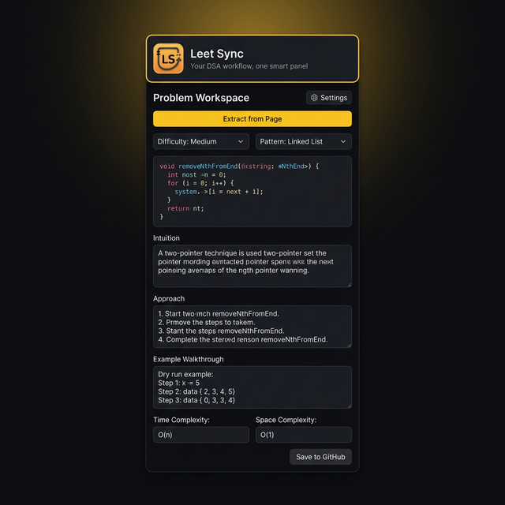
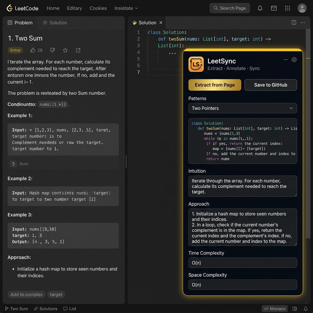
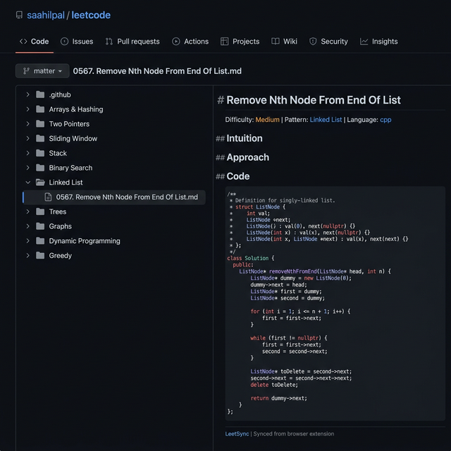

# LeetSync ⚡

<p align="center">
  
</p>

<p align="center">
  <b>Automatically sync your LeetCode solutions to GitHub.</b><br />
  Build a professional DSA portfolio with one click.
</p>

<p align="center">
  
  
  
  
</p>

---

LeetSync is a Chrome extension that extracts your LeetCode code, lets you write structured analysis (Intuition, Approach, Walkthrough, Complexity), and pushes polished Markdown files to your GitHub repository — organized by 18 DSA patterns.

## 📸 Screenshots

### Popup UI
> The full-featured popup panel — extract code, write notes, and push to GitHub without leaving your browser.

<p align="center">
  
</p>

### Floating Overlay on LeetCode
> A persistent overlay that lives right on the LeetCode page — no tab switching needed.

<p align="center">
  
</p>

### GitHub Output
> Clean, pattern-organized Markdown files pushed directly to your repository.

<p align="center">
  
</p>

---

## ✨ Features

| Feature | Description |
|---------|-------------|
| 🚀 **One-Click Extract** | Instantly captures problem title, difficulty, language, and your code from the LeetCode Monaco editor |
| 📝 **Structured Notes** | Built-in fields for Intuition, Approach, Example Walkthrough, and Time/Space Complexity |
| 📂 **Pattern-Based Organization** | Auto-organizes solutions into 18 DSA pattern folders (Two Pointers, Trees, Graphs, DP, etc.) |
| 🎯 **Floating Overlay** | A draggable, dockable panel injected directly into LeetCode — no tab switching |
| 🖥️ **Popup Panel** | Also works as a traditional Chrome extension popup |
| 🔒 **100% Offline & Secure** | Zero backend. Your GitHub PAT stays in `chrome.storage.local` — never leaves your browser |
| ⚡ **Manifest V3** | Built with modern Chrome extension standards for performance and longevity |
| 🎨 **Premium Dark UI** | Professional dark theme with gold accents, smooth animations, and a polished feel |

---

## 🛠 Installation

### Build from Source

```bash
# Clone the repository
git clone https://github.com/saahilpal/LeetSync.git
cd LeetSync

# Install dependencies
npm install

# Build the extension
npm run build
```

### Load into Chrome

1. Open Chrome and navigate to `chrome://extensions`
2. Enable **Developer Mode** (top-right toggle)
3. Click **Load unpacked**
4. Select the `dist` folder generated by `npm run build`

---

## ⚙️ Setup

### 1. Create a GitHub Personal Access Token

1. Go to [GitHub → Settings → Tokens (Classic)](https://github.com/settings/tokens)
2. Click **Generate new token (classic)**
3. Give it a name (e.g., `LeetSync`)
4. Select the **`repo`** scope (full control of private repositories)
5. Click **Generate token** and copy it

### 2. Create a GitHub Repository

Create a new repository on GitHub (e.g., `leetcode-solutions`). This is where your solutions will be pushed.

### 3. Configure the Extension

1. Click the LeetSync icon in your Chrome toolbar
2. Enter your **GitHub PAT** (`ghp_...` or `github_pat_...`)
3. Enter your **GitHub username**
4. Enter your **repository name**
5. Click **Finish** — you're ready to go!

---

## 🚀 Usage

1. **Navigate** to any LeetCode problem page
2. **Click "Extract from Page"** to capture the problem code, title, difficulty, and language
3. **Select a pattern** (Two Pointers, Trees, etc.) and difficulty
4. **Write your notes** — Intuition, Approach, Example Walkthrough
5. **Add complexity** — Time and Space complexity
6. **Click "Save to GitHub"** — a polished Markdown file is pushed to your repo

### Floating Overlay

The overlay automatically appears on LeetCode problem pages. You can:
- **Drag** the bubble to reposition it
- **Minimize** to a floating bubble
- **Dock** to any edge of the screen
- Use the **⚙ Settings** button to manage your GitHub configuration

---

## 📂 Repository Structure

After syncing, your GitHub repository will be organized like this:

```
leetcode-solutions/
├── Arrays & Hashing/
│   └── 0001-Two-Sum.md
├── Two Pointers/
│   └── 0015-3Sum.md
├── Linked List/
│   └── 0567-Remove-Nth-Node-From-End-Of-List.md
├── Trees/
│   └── 0104-Maximum-Depth-Of-Binary-Tree.md
├── Dynamic Programming/
│   └── 0070-Climbing-Stairs.md
└── ...
```

### 18 DSA Patterns

| | | |
|---|---|---|
| Arrays & Hashing | Two Pointers | Sliding Window |
| Stack | Binary Search | Linked List |
| Trees | Heap / Priority Queue | Backtracking |
| Tries | Graphs | Advanced Graphs |
| 1-D Dynamic Programming | 2-D Dynamic Programming | Greedy |
| Intervals | Math & Geometry | Bit Manipulation |

---

## 📂 First-Time Repo Setup (Optional)

GitHub's API cannot create empty folders. To pre-scaffold the 18 pattern folders, run one of these scripts **once** inside your local repository, then push.

<details>
<summary><b>macOS / Linux (Bash)</b></summary>

```bash
#!/bin/bash
patterns=(
  "Arrays & Hashing" "Two Pointers" "Sliding Window" "Stack" "Binary Search"
  "Linked List" "Trees" "Heap - Priority Queue" "Backtracking" "Tries"
  "Graphs" "Advanced Graphs" "1-D Dynamic Programming" "2-D Dynamic Programming"
  "Greedy" "Intervals" "Math & Geometry" "Bit Manipulation"
)
for p in "${patterns[@]}"; do
  mkdir -p "$p"
  echo -e "# $p\n\nSolutions for the **$p** pattern." > "$p/README.md"
  echo "✅ Created: $p/"
done
git add . && git commit -m 'init: scaffold pattern folders' && git push
```

</details>

<details>
<summary><b>Windows (PowerShell)</b></summary>

```powershell
$patterns = @(
  "Arrays & Hashing", "Two Pointers", "Sliding Window", "Stack", "Binary Search",
  "Linked List", "Trees", "Heap - Priority Queue", "Backtracking", "Tries",
  "Graphs", "Advanced Graphs", "1-D Dynamic Programming", "2-D Dynamic Programming",
  "Greedy", "Intervals", "Math & Geometry", "Bit Manipulation"
)
foreach ($p in $patterns) {
  New-Item -ItemType Directory -Force -Path $p | Out-Null
  "# $p`n`nSolutions for the **$p** pattern." | Set-Content "$p\README.md"
  Write-Host "Created: $p/"
}
git add . ; git commit -m 'init: scaffold pattern folders' ; git push
```

</details>

<details>
<summary><b>Windows (CMD)</b></summary>

```cmd
@echo off
for %%p in (
  "Arrays & Hashing" "Two Pointers" "Sliding Window" "Stack" "Binary Search"
  "Linked List" "Trees" "Heap - Priority Queue" "Backtracking" "Tries"
  "Graphs" "Advanced Graphs" "1-D Dynamic Programming" "2-D Dynamic Programming"
  "Greedy" "Intervals" "Math & Geometry" "Bit Manipulation"
) do (
  mkdir %%~p 2>nul
  echo # %%~p > "%%~p\README.md"
  echo. >> "%%~p\README.md"
  echo Solutions for the **%%~p** pattern. >> "%%~p\README.md"
  echo Created: %%~p/
)
git add . && git commit -m "init: scaffold pattern folders" && git push
```

</details>

---

## 🧰 Tech Stack

| Tool | Purpose |
|------|---------|
| **TypeScript** | Type-safe extension logic |
| **Vite** | Fast bundling for Manifest V3 |
| **Chrome Extensions API** | Storage, tabs, messaging, scripting |
| **GitHub REST API** | Direct file creation/updates via PAT |
| **Shadow DOM** | CSS-isolated floating overlay on LeetCode |

---

## 📁 Project Structure

```
LeetSync/
├── public/
│   ├── assets/          # Logo and screenshots
│   ├── icons/           # Extension icons (16, 32, 48, 128)
│   ├── manifest.json    # Chrome MV3 manifest
│   ├── popup.html       # Popup UI markup
│   └── popup.css        # Popup styles
├── src/
│   ├── background/
│   │   ├── index.ts     # Service worker (message routing)
│   │   ├── github.ts    # GitHub API integration
│   │   └── path.ts      # File path builder
│   ├── content/
│   │   └── content.ts   # Content script (overlay + extraction)
│   ├── injected/
│   │   └── injectMonaco.ts  # Monaco editor bridge
│   ├── popup/
│   │   ├── popup.ts     # Popup logic
│   │   └── success.ts   # Auth success page
│   └── utils/
│       ├── markdown.ts  # Markdown generator
│       └── patterns.ts  # DSA pattern list
├── vite.config.ts
├── tsconfig.json
└── package.json
```

---

## 👨‍💻 Developed By

**Sahil Pal**

- [GitHub](https://github.com/saahilpal)
- [LinkedIn](https://www.linkedin.com/in/sahiilpal)
- [LeetCode](https://leetcode.com/u/saahiilpal/)

---

<p align="center">
  Built for developers who take their DSA journey seriously. ⚡
</p>
